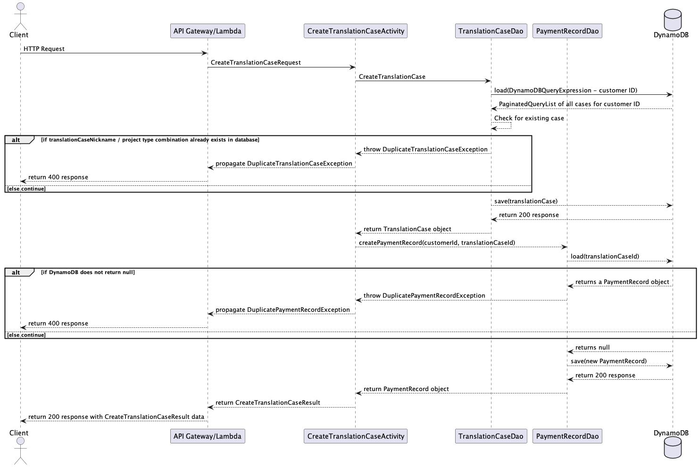
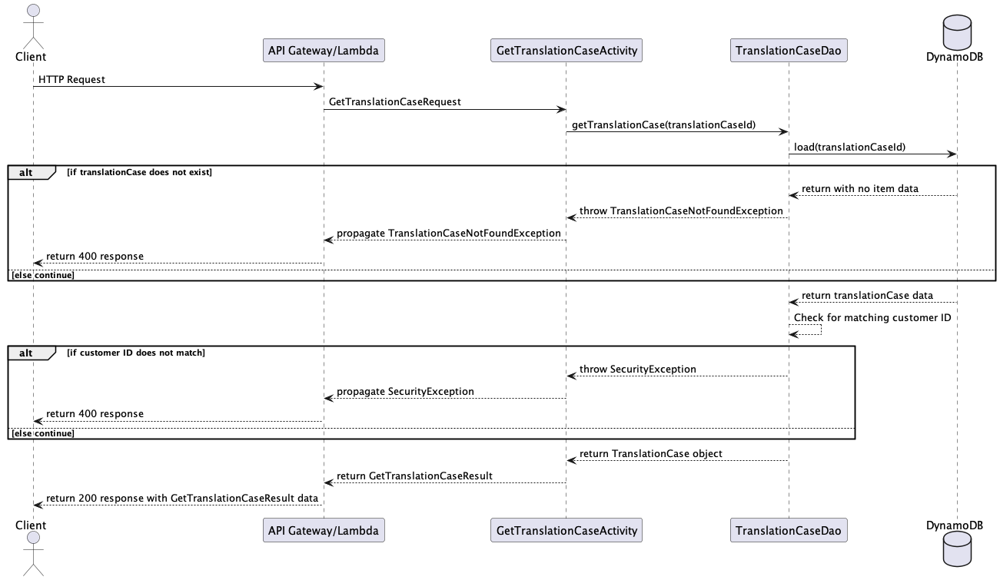

# Design Document

## Translation Tracker Design

## 1. Problem Statement

At present, translation case management solutions for freelance translators are virtually non-existent. My product will 
address common translator needs by storing details for individual translation cases, estimating the time and cost for 
prospective cases, tracking upcoming deadlines, and providing a variety of interesting statistics that will help the 
translator to improve productivity.

## 2. Top Questions to Resolve in Review

_List the most important questions you have about your design, or things that you are still debating internally that 
you might like help working through._

1. I would like to soft-delete translation clients and translation cases - would I still use DELETE in the endpoint? 
2. 
3.

## 3. Use Cases

#### Translation Cases

U1. As a customer, I want to be able to view details about a translation case in a separate webpage.

U2. As a customer, I want to be able to create a new translation case.

U3. As a customer, I want to be able to store relevant details about my translation case, such as cost per character, 
  total payment, and whether the case is still open.

U4. As a customer, I want to update existing translation cases with details about my translation progress (word count, 
  dates, times).

U5. As a customer, I want to be able to view a payment record by clicking a link on the associated translation
case page.


#### Translation Clients

U5. As a customer, I want to be able to view details about a translation client in a separate webpage.

U6. As a customer, I want to be able to see all translation cases associated with a translation client.

U7. As a customer, I want to be able to add a new translation case from the translation client detail page.

U8. As a customer, I want to see a clickable list of all translation cases associated with a translation client.

U9. As a customer, I want to see a clickable list of all payment records associated with a translation client.


#### Payment Records

U10. As a customer, I want to be able to view a payment record in a separate page.

U11. As a customer, I want to be able to update an existing payment record with relevant details.


#### Home Page

U12. As a customer, I want to see a list of open translation cases on the home page, sorted by soonest deadline.

U13. As a customer, I want to add a new translation case from the home page.

U14. As a customer, I want to click a link on the home page to see a clickable list of all translation cases.

U15. As a customer, I want to click a link on the home page to see a clickable list of all translation clients.


### Stretch Goals

#### Estimates

SG1. As a customer, I want to create a new estimate from the home page.

SG2. As a customer, I want to create a new translation client and either associate it with an existing translation client or create a new client at the same time.

SG3. As a customer, I want to create new case estimates with estimated time needed for completion.

SG4. As a customer, I want to create new case estimates with a suggested pricing based on past cases of the same type.

SG5. As a customer, I want to create new case estimates that show potential time conflicts with currently open cases.


#### Statistics

SG6. As a customer, I want to see useful statistics about my translation habits displayed on the home page.


## 4. Project Scope

### 4.1. In Scope

#### Translation Cases
* Create a new translation case that contains useful details
* Retrieve information about existing translation cases
* Retrieve a list of all translation cases
* Update progress on existing translation cases
* Archive (soft-delete) translation cases

#### Translation Clients
* Create a new translation client
* Retrieve translation client information
* Retrieve a list of all translation clients
* Retrieve all translation cases associated with a translation client
* Retrieve all payment records associated with a translation client
* Update information about the translation client
* Archive (soft-delete) a translation client

### Stretch Goals

#### Estimates
* Create a new estimate
* Save an estimate by assigning it to an existing translation client or by creating a new translation client
* Retrieve past estimates
* Retrieve a list of all estimates, sorted by project type
* Retrieve a list of all estimates, sorted by translation client
* Link an existing estimate to a new translation case
* Update the estimate with notes on negotiation or other details (saved estimate is read-only, notes can be edited)
* Archive (soft-delete) an estimate

#### Statistics
* Pull statistics from the translation cases
  * Words translated per hour compared by project type
  * Most productive time of day for each project type
  * Largest project type by case count
  * Total translation time since beginning of year / month
  * Translation clients with the fastest payment turnaround time
  * etc.


### 4.2. Out of Scope

* Linking accounts
* Storing translated documents
* Making translation keywords searchable
* Creating estimates that can be sent to customers directly

# 5. Proposed Architecture Overview

This initial iteration will provide the minimum loveable product (MLP) including creating, retrieving, updating and 
  archiving translation cases, translation clients, and payment records as well as sorting these objects in useful ways.

I will use API Gateway and Lambda to create twelve endpoints (`CreateTranslationCase`, `GetTranslationCase`, 
  `GetAllTranslationCases`, `UpdateTranslationCase`, `ArchiveTranslationCase`, `CreateTranslationClient`,
  `GetTranslationClient`, `GetAllTranslationClients`, `UpdateTranslationClient`, `ArchiveTranslationClient`,
  `AddProgressUpdate`, `GetPaymentRecord`, `UpdatePaymentRecord`) that will handle the creation, update, 
  retrieval and archiving of translation clients, translation cases, and payment records.

I will store the translation clients and translation cases in tables in DynamoDB.

TranslationTracker will also provide a web interface for users to manage their translation cases, translation clients, 
  and payment records. A main page providing lists of the translation cases with the soonest upcoming deadlines, links
  to a full list of translation cases and translation clients, and links to create a new translation case or translation
  client. Translation cases, translation clients, and payment records will be clickable and will go to a separate detail
  page where updates can be made.

# 6. API

## 6.1. Public Models

```
// TranslationCaseModel

String customerId
String translationCaseId
String translationClientId
String caseNickname
String sourceTextTitle
String sourceTextAuthor
String translatedTitle
ProjectType projectType
String dueDate
String startDate
String endDate
Boolean openCase
Boolean rushJob
List<ProgressUpdate> progressLog
Double totalWorkingHours
Double wordsPerHour

// TranslationClientModel

String customerId
String translationClientId
String translationClientName
Enum translationClientType
```

### Stretch Goal

```
// EstimateModel

String estimateId;
String translationClientId;
String translationClientName;
String translationClientType;
String sourceTextTitle;
String sourceTextAuthor;
Double estimatedRate;
String estimatedRateUnit;
Integer count;
String countUnit;
Double estimatedGrossPayment;
Double taxRate;
String projectType;
String dueDate;
Double totalWorkingHoursEstimate;
Double wordsPerHourEstimate;
```

## 6.2 Create Translation Case Endpoint

* Accepts `POST` requests to `/translationcases`
* Accepts data to create a new `TranslationCase` with a provided caseNickname, projectType, and customerId,
  all other values being optional.
* Also creates a new `PaymentRecord` with the customer ID and translation case ID.
* Returns the new `TranslationCaseModel`, including a unique translation case ID assigned by Translation Tracker.
  * If the caseNickname / projectType pair is identical to an already-existing caseNickname / projectType pair, will throw a
    `DuplicateCaseNicknameException`.
  * If the given translation case ID is identical to an already-existing `PaymentRecord`, will throw a 
    `DuplicatePaymentRecordException`.



## 6.3. Get Translation Case Endpoint

* Accepts `GET` requests to `/translationcases/case
* Accepts a customer ID and translation case ID and returns the corresponding `TranslationCaseModel`
* Returns the corresponding `TranslationCaseModel`
    * If the given translation case ID is not found, will throw a
      `TranslationCaseNotFoundException`
    * If the given customer ID does not match, will throw a
      `SecurityException`



## 6.4. Get All Translation Cases Endpoint

* Accepts `GET` requests to `/translationcases/`
* Retrieves all translation cases for the given customer ID.
* Returns the list of `TranslationCaseModel`.
  * If there are no translation cases, will throw a `TranslationCaseNotFoundException`.


## 6.5 Update Translation Case Endpoint

* Accepts `PUT` requests to `/translationcases/case`
* Accepts data to update a `TranslationCase` including a customer ID, translation case ID, and the update values. Returns the updated
  `TranslationCase`.
* Returns the updated `TranslationCaseModel`.
    * If the given translation case ID is not found, will throw a 
      `TranslationCaseNotFoundException`.
    * If the given customer ID does not match, will throw a
      `SecurityException`.


## 6.6 Archive Translation Case Endpoint

* Accepts `DELETE` requests to `/translationcases/case`
* Accepts a customer ID and translation case ID and archives the corresponding `TranslationCase`.
* Also archives the corresponding `PaymentRecord`.
* Returns the original `TranslationCaseModel`.
  * If the translation case is not found, will throw a `TranslationCaseNotFoundException`.
  * If the given customer ID does not match the translation case, will throw a
    `SecurityException`.
  * If the payment record is not found, will throw a `TranslationCaseNotFoundException`.
  * If the given customer ID does not match the payment record, will throw a
    `SecurityException`.


## 6.7 Add Progress Update Endpoint

* Accepts `PUT` requests to `/translationcases/case/update`
* Accepts a customer ID, translation case ID, and progress update values.
* Returns the updated `TranslationCaseModel`.
  * If the given translation case ID is not found, will throw a `TranslationCaseNotFoundException`.
  * If the given customer ID does not match the translation case, will throw a
    `SecurityException`.
  * If the translation case customer ID does not match the progress update, will throw a
    `SecurityException`.
  * If the progress update already exists in the progress log, will throw a 
    `DuplicateProgressUpdateException`


## 6.8 Get Payment Record Endpoint

* Accepts `GET` requests to `/translationcases/case/payment`
* Accepts a customer ID and translation case ID.
* Returns the corresponding `PaymentRecordModel`.
  * If the given translation case ID is not found, will throw a `TranslationCaseNotFoundException`.
  * If the given customer ID does not match, will throw a `SecurityException`.


## 6.9 Update Payment Record Endpoint

* Accepts `PUT` requests to `/translationcases/case/payment`
* Accepts a customer ID, translation case ID and update values.
* Returns the updated `PaymentRecordModel`.
  * If the given translation case ID is not found, will throw a `TranslationCaseNotFoundException`.
  * If the given customer ID does not match, will throw a `SecurityException`.


## 6.10 Create Translation Client Endpoint

* Accepts `POST` requests to `/translationclients`
* Accepts data to create a new `TranslationClient` with the provided customer ID, translation client name and translation client type,
  with all other values being optional.
* Returns the new `TranslationClientModel`, including a unique translation client ID assigned by Translation Tracker.
  * If the translationClientName is identical to an already-existing translationClientName, will throw a
    `DuplicateTranslationClientException`.


## 6.11 Get Translation Client Endpoint

* Accepts `GET` requests to `/translationclients/client`
* Accepts a translation customer ID and client ID and returns the corresponding `TranslationClientModel`.
  * If the given translation client ID is not found, will throw a `TranslationClientNotFoundException`.
  * If the given customer ID does not match, will throw a `SecurityException`.


## 6.12. Get All Translation Cases Endpoint

* Accepts `GET` requests to `/translationclients/`
* Retrieves a list of all translation clients associated with the customer ID.
* Returns the list of `TranslationClientModel`.
  * If the list of translation clients is empty, will throw a `TranslationClientNotFoundException`.


## 6.13 Archive Translation Client Endpoint

* Accepts `DELETE` requests to `/translationclients/client`
* Accepts a customer ID and translation client ID and archives the specified `TranslationClient`.
  * If the translation client ID is not found, will throw a `TranslationClientNotFoundException`.
  * If the given customer ID does not match, will throw a `SecurityException`.


# 7. Tables

### 7.1. `translation_cases`
```
translationCaseId // partition key, string
translationClientId // string
caseNickname // string
projectType // string
mostRecentActivity // string
sourceTextTitle // string
sourceTextAuthor // string
translatedTitle // string
dueDate // string
startDate // string
endDate // string
openCase // boolean
rushJob // boolean
progressLog // string
totalWorkingHours // number
wordsPerHour // number
```

### 7.2. `translation_clients`
```
translationClientId // partition key, string
translationClientName // string
translationClientType // string
mostRecentActivity // string
```

### 7.3 `payment_records`
```
customerId // string 
translationCaseId // string 
translationClientId // string 
casePaid // boolean
paymentDate // string 
onTime // boolean
grossPayment // number 
taxRate // number 
payRate // number 
payRateUnit // string 
wordCount // number
wordCountUnit // string 
```


# 8. Pages

### 8.1 Home Page


### 8.2 Translation Case Detail Page


### 8.2 Translation Client Detail Page

