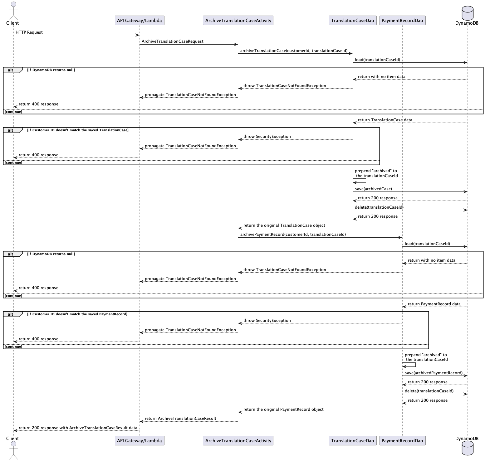
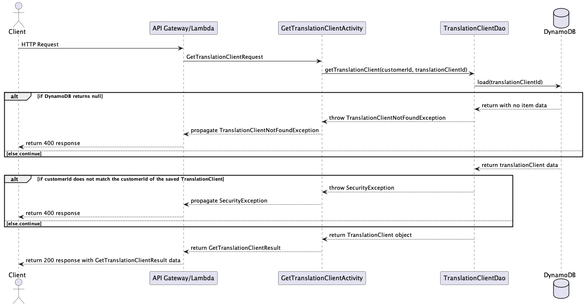

# Design Document

## Translation Tracker Design

## 1. Problem Statement

At present, translation case management solutions for freelance translators are virtually non-existent. My product will 
address common translator needs by storing details for individual translation cases, estimating the time and cost for 
prospective cases, tracking upcoming deadlines, and providing a variety of interesting statistics that will help the 
translator to improve productivity.

## 2. Top Questions to Resolve in Review

_List the most important questions you have about your design, or things that you are still debating internally that 
you might like help working through._

1. I would like to soft-delete translation clients and translation cases - would I still use DELETE in the endpoint? 
2. 
3.

## 3. Use Cases

#### Translation Cases

U1. As a customer, I want to be able to view details about a translation case in a separate webpage.

U2. As a customer, I want to be able to create a new translation case and either associate it with an existing 
  translation client or create a new translation client at the same time.

U3. As a customer, I want to be able to store relevant details about my translation case, such as cost per character, 
  total payment, and whether the case is still open.

U4. As a customer, I want to update existing translation cases with details about my translation progress (word count, 
  dates, times).


#### Translation Clients

U5. As a customer, I want to be able to view details about a translation client in a separate webpage.

U6. As a customer, I want to be able to edit translation client info.

U7. As a customer, I want to be able to add a new translation case from the translation client detail page.

U8. As a customer, I want to see a clickable list of all translation cases associated with a translation client, 
  sorted by most recent activity.

U9. As a customer, I want to see a clickable list of all translation cases associated with a translation client, sorted 
  reverse-chronologically by creation date.  

#### Home Page

U10. As a customer, I want to see a list of open translation cases on the home page, sorted by soonest deadline.

U11. As a customer, I want to add a new translation case from the home page.

U12. As a customer, I want to search for a translation client from the home page.

U13. As a customer, I want to search for a translation case from the home page.

U14. As a customer, I want to click a link on the home page to see a clickable list of all translation clients that can be sorted in multiple ways (alphabetically, most recent activity).

U15. As a customer, I want to click a link on the home page to see a clickable list of all translation that can be sorted in multiple ways (project type, most recent activity).


### Stretch Goals

#### Estimates

U16. As a customer, I want to create a new estimate from the home page.

U17. As a customer, I want to create a new translation client and either associate it with an existing translation client or create a new client at the same time.

U18. As a customer, I want to create new case estimates with estimated time needed for completion.

U19. As a customer, I want to create new case estimates with a suggested pricing based on past cases of the same type.

U20. As a customer, I want to create new case estimates that show potential time conflicts with currently open cases.


#### Statistics

U21. As a customer, I want to see useful statistics about my translation habits displayed on the home page.


## 4. Project Scope

### 4.1. In Scope

#### Translation Cases
* Create a new translation case that contains useful details
  * Must assign an existing translation client or create a new translation client during new translation case creation
* Retrieve information about existing translation cases
* Retrieve a list of all translation cases, sorted by project type
* Retrieve a list of all translation cases, sorted by most recent activity
* Update progress on existing translation cases
* Archive (soft-delete) translation cases

#### Translation Clients
* Create a new translation client
* Retrieve translation client information
* Retrieve a list of all translation clients, sorted alphabetically
* Retrieve a list of all translation clients, sorted by most recent activity
* Retrieve all translation cases associated with a translation client
* Update information about the translation client
* Archive (soft-delete) a translation client

### Stretch Goals

#### Estimates
* Create a new estimate
* Save an estimate by assigning it to an existing translation client or by creating a new translation client
* Retrieve past estimates
* Retrieve a list of all estimates, sorted by project type
* Retrieve a list of all estimates, sorted by translation client
* Link an existing estimate to a new translation case
* Update the estimate with notes on negotiation or other details (saved estimate is read-only, notes can be edited)
* Archive (soft-delete) an estimate

#### Statistics
* Pull statistics from the translation cases
  * Words translated per hour compared by project type
  * Most productive time of day for each project type
  * Largest project type by case count
  * Total translation time since beginning of year / month
  * Translation clients with the fastest payment turnaround time
  * etc.


### 4.2. Out of Scope

* Linking accounts
* Storing translated documents
* Making translation keywords searchable
* Creating estimates that can be sent to customers directly

# 5. Proposed Architecture Overview

This initial iteration will provide the minimum loveable product (MLP) including creating, retrieving, updating and 
  archiving translation cases and translation clients, as well as sorting these objects in useful ways.

I will use API Gateway and Lambda to create seven endpoints (`GetTranslationCase`, `CreateTranslationCase`, 
`UpdateTranslationCase`, `ArchiveTranslationCase`, `GetTranslationClient`, `UpdateTranslationClient`, 
  `ArchiveTranslationClient`) that will handle the creation, update, retrieval and archiving of translation clients 
  and translation cases.

I will store the translation clients and translation cases in tables in DynamoDB.

TranslationTracker will also provide a web interface for users to manage their translation cases and translation 
  clients. A main page providing lists of the translation cases with the soonest upcoming deadlines and translation 
  clients with most recent activity will allow creation of new translation cases and link off to pages per-translation 
  client and per-translation case to update translation progress and other details.

# 6. API

## 6.1. Public Models

```
// TranslationCaseModel

String translationCaseId;
String translationClientId;
String mostRecentActivity;
String sourceTextTitle;
String sourceTextAuthor;
String translatedTitle;
String caseNickname;
ProjectType projectType;
String dueDate;
String startDate;
String endDate;
Boolean openCase;
Boolean rushJob;
List<TranslationCaseUpdate> progressLog;
PaymentHistoryRecord paymentRecord;
Double totalWorkingHours;
Double wordsPerHour;

// TranslationClientModel

String translationClientId;
String translationClientName;
Enum translationClientType;
String mostRecentActivity;
```

### Stretch Goal

```
// EstimateModel

String estimateId;
String translationClientId;
String translationClientName;
String translationClientType;
String sourceTextTitle;
String sourceTextAuthor;
Double estimatedRate;
String estimatedRateUnit;
Integer count;
String countUnit;
Double estimatedGrossPayment;
Double taxRate;
String projectType;
String dueDate;
Double totalWorkingHoursEstimate;
Double wordsPerHourEstimate;
```

## 6.2. Get Translation Case Endpoint

* Accepts `GET` requests to `/translationcases/:id`
* Accepts a translation case ID and returns the corresponding `TranslationCaseModel`.
    * If the given translation case ID is not found, will throw a
      `TranslationCaseNotFoundException`


## 6.3. Get All Translation Cases Endpoint

* Accepts `GET` requests to `/translationcases/`
* Retrieves all translation cases
  * Returns the list of translation cases in default order
  * If the optional `order` parameter is provided, this API will return the
    translation case list in order of most recent activity or alphabetically by
    translation case nickname, based on the value of `order`
    * DEFAULT - same as default behavior, returns translation cases in order of most recent activity
    * ALPHABETIC - returns translation cases in alphabetic order by translation case nickname
* If there are no translation cases, the list will be empty


## 6.4 Create Translation Case Endpoint

* Accepts `POST` requests to `/translationcases`
* Accepts data to create a new `TranslationCase` with a provided caseNickname, projectType, and translationClientId, 
  all other values being optional. 
* Returns the new `TranslationCaseModel`, including a unique translation case ID assigned by Translation Tracker.
  * If the caseNickname is identical to an already-existing caseNickname, will throw a 
    `DuplicateCaseNicknameException`.


## 6.5 Update Translation Case Endpoint

* Accepts `PUT` requests to `/translationcases/:id`
* Accepts data to update a `TranslationCase` including a translation case ID, and the update values. Returns the updated
  `TranslationCase`.
    * If the given translation case ID is not found, will throw a `TranslationCaseNotFoundException`


## 6.6 Archive Translation Case Endpoint

* Accepts `DELETE` requests to `/translationcases/:id`
* Accepts a translation case ID and archives the corresponding `TranslationCase`.
  * If the translation case ID is not found, will throw a `TranslationCaseNotFoundException`



## 6.7 Get Translation Client Endpoint

* Accepts `GET` requests to `/translationclients/:id`
* Accepts a translation client ID and returns the corresponding `TranslationClientModel`.
  * If the given translation client ID is not found, will throw a `TranslationClientNotFoundException`



## 6.8. Get All Translation Cases Endpoint

* Accepts `GET` requests to `/translationclients/`
* Retrieves all translation clients
  * Returns the list of translation clients in default order
  * If the optional `order` parameter is provided, this API will return the
    translation case list in order of most recent activity or alphabetically by
    translation client name, based on the value of `order`
    * DEFAULT - same as default behavior, returns translation cases in order of most recent activity
    * ALPHABETIC - returns translation cases in alphabetic order by translation client name
* If there are no translation clients, the list will be empty


## 6.9 Create Translation Client Endpoint

* Accepts `POST` requests to `/translationclients`
* Accepts data to create a new `TranslationClient` with the provided translationClientName and translationClientType, 
   with all other values being optional.
* Returns the new `TranslationClientModel`, including a unique translation client ID assigned by Translation Tracker.
  * If the translationClientName is identical to an already-existing translationClientName, will throw a
    `DuplicateTranslationClientException`.


## 6.10 Update Translation Client Endpoint

* Accepts `PUT` requests to `/translationclients/:id`
* Accepts data to update a `TranslationClient` including a translation client ID, and the update values. Returns the updated
  `TranslationClientModel`.
  * If the client ID is not found, will throw a `TranslationClientNotFoundException`


## 6.11 Archive Translation Client Endpoint

* Accepts `DELETE` requests to `/translationclients/:id`
* Accepts a translation client ID and archives the specified `TranslationClient`.
  * If the translation client ID is not found, will throw a `TranslationClientNotFoundException`


# 7. Tables

### 7.1. `translationCases`
```
translationClientId // partition key, string
translationCaseId // sort key, string
caseNickname // string
projectType // string
mostRecentActivity // string
sourceTextTitle // string
sourceTextAuthor // string
translatedTitle // string
dueDate // string
startDate // string
endDate // string
openCase // boolean
rushJob // boolean
progressLog // string
totalWorkingHours // number
wordsPerHour // number
```

### 7.2. `translationClients`
```
translationClientId // partition key, string
translationClientName // string
translationClientType // string
mostRecentActivity // string
```


# 8. Pages

### 8.1 Home Page


### 8.2 Translation Case Detail Page


### 8.2 Translation Client Detail Page

